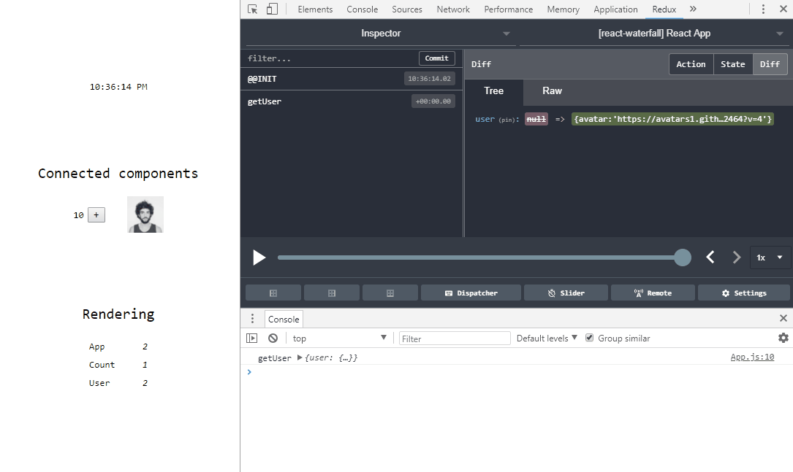

[](https://badge.fury.io/js/react-waterfall-redux-devtools-middleware)
# react-waterfall-redux-devtools-middleware
An integration between react-waterfall and redux-devtools-extension for action monitoring and time travel

```diff
- THIS IS FOR REACT-WATERFALL v3 ONLY
- v4 HAS IT OUT OF THE BOX
```



## Example

```js
import { initStore } from 'react-waterfall'
import reduxDevTools from 'react-waterfall-redux-devtools-middleware'

const store = {
  initialState: { count: 0 },
  actions: {
    increment: ({ count }) => ({ count: count + 1 }),
  },
}

const { Provider, connect } = initStore(store, reduxDevTools())

let Count = ({ count, actions }) => (
  <>
    {count}
    <button onClick={actions.increment}>+</button>
  </>
)

Count = connect(state => ({ count: state.count }))(Count)

const App = () => (
  <Provider>
    <Count />
  </Provider>
)
```

### Using the middleware

`yarn add react-waterfall-redux-devtools-middleware`

You create the middleware by:
```js
import reduxDevTools from 'react-waterfall-redux-devtools-middleware'
...
const { ... } = initStore(store, reduxDevTools(options))
```

* You can ommit the `options` argument and get the defaults (i.e. `reduxDevTools()`).

##### Options


| Option | Type | Description | Default value
|--------|------|-------------|--------------
|instanceId|Number|The instance of the store, needs to be different if you used initStore several times|1
|maxAge|Number (>1)|maximum allowed actions to be stored in the history tree|50
